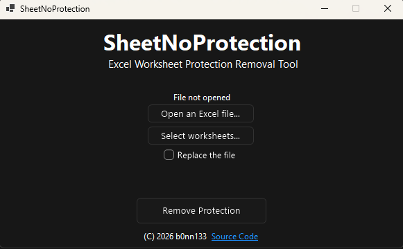

   </img>
   <h1>🔓 SheetNoProtection</h1>

**SheetNoProtection** is a lightweight C# WinForms utility to instantly remove protection from Excel Worksheets.

## ✨ Features
- **Instant Unlock**: Removes worksheet protection passwords in seconds.
- **Modern Compatibility**: Supports all XML-based formats (`.xlsx`, `.xlsm`, `.xltx`, `.xltm`).
- **Standalone**: No Microsoft Excel installation or Interop libraries required.
- **Safe**: Processes files by modifying the internal XML structure directly.

## 📥 Installation
Download the latest standalone executable from the [Releases](https://github.com/b0nn133/SheetNoProtection/releases) page.

## 🛠 Building
1. Clone the repository: `git clone https://github.com/b0nn133/SheetNoProtection`
2. Open the `.slnx` file in **Visual Studio 2026**.
3. Build the solution (Ctrl+Shift+B).

## 🤝 Contributing
Contributions make the open-source community great!
1. Fork the project.
2. Create your feature branch.
3. Open a Pull Request for review.

## 📜 License
Distributed under the [GNU General Public License 3.0](./LICENSE).
